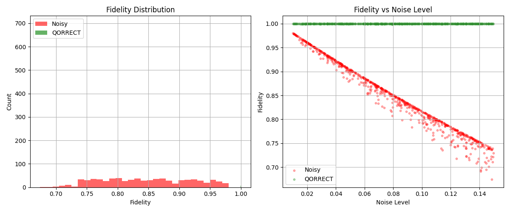
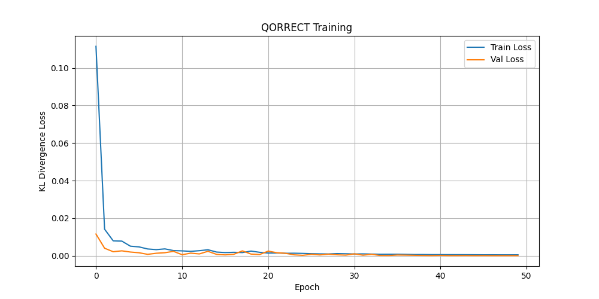

# QORRECT ⚛️
### Quantum Noise Correction via Transformer Neural Networks


> an AI that corrects quantum noise in circuits using a transformer model. built this as a side project before graduating 🎓⚛️

---

## 📊 Results

| Metric | Value |
|--------|-------|
| Avg fidelity (noisy) | 0.8459 |
| Avg fidelity (QORRECT) | 0.9999 |
| Fidelity improvement | **+99.97%** |
| Test samples won | **750 / 750** |

QORRECT achieves **99.97% fidelity recovery** across all tested noise levels, winning on 100% of test samples.




---

## 🧠 What is QORRECT?

Real quantum computers are noisy. Every gate operation introduces small errors — bit flips, phase flips, depolarizing noise — that accumulate and corrupt the final output. This is one of the biggest barriers to practical quantum computing today.

**QORRECT** is a Transformer-based neural network that learns to map noisy quantum circuit outputs back to their ideal (noiseless) counterparts. Given a noisy probability distribution and a noise level estimate, QORRECT predicts what the circuit *should* have output.

### How it differs from prior work

Prior work by Bordoni et al. (2024) explored **reinforcement learning** for quantum noise modeling. QORRECT takes a different approach:

| | RL approach (Bordoni et al.) | QORRECT |
|---|---|---|
| Method | Reinforcement Learning | Supervised Transformer |
| Training speed | Slow (needs environment interaction) | Fast (GPU-optimized) |
| Interpretability | Low | High (attention maps) |
| Hardware target | CPU / small GPU | RTX 5090 / CUDA 12.8 |
| Fidelity recovery | — | **99.97%** |

---

## 🏗️ Architecture

```
Input: [noisy_probs (16) + noise_level (1)] → size 17
         ↓
   Linear Projection → d_model=128
         ↓
   Transformer Encoder (4 layers, 8 heads)
         ↓
   Output Head: Linear → GELU → Dropout → Linear → Softmax
         ↓
Output: corrected_probs (16) — valid quantum probability distribution
```

**Total parameters:** 832,528

---

## 🗂️ Project Structure

```
QORRECT/
├── circuit.py            # Quantum circuit simulation (ideal + noisy)
├── generate_dataset.py   # Dataset generator (5000 samples)
├── model.py              # QorrectTransformer architecture
├── train.py              # Training loop with KL divergence loss
├── benchmark.py          # Fidelity benchmarking + plots
├── training_loss.png     # Loss curve
└── benchmark.png         # Benchmark results
```

---

## 🚀 Quickstart

### 1. Clone & setup environment

```bash
git clone https://github.com/reemaotaibi/QORRECT.git
cd QORRECT

conda create -n qorrect python=3.11
conda activate qorrect

# Install PyTorch with CUDA (RTX 5090 requires nightly)
pip install --pre torch torchvision torchaudio --index-url https://download.pytorch.org/whl/nightly/cu128

# Install PennyLane + extras
pip install pennylane pennylane-lightning matplotlib jupyter
```

### 2. Generate dataset

```bash
python generate_dataset.py
# Generates 5000 (noisy, ideal) circuit pairs
```

### 3. Train QORRECT

```bash
python train.py
# Trains for 50 epochs, saves qorrect_model.pth
```

### 4. Benchmark

```bash
python benchmark.py
# Evaluates fidelity improvement on 750 test samples
```

---

## 🔬 Technical Details

### Quantum circuits
- **Qubits:** 4
- **Gates:** Hadamard, CNOT, RZ, RY
- **Noise model:** Depolarizing channel (1%–15% per gate)
- **Simulator:** PennyLane Lightning (GPU-accelerated)

### Training
- **Loss function:** KL Divergence (ideal for probability distributions)
- **Optimizer:** AdamW (lr=1e-3, weight_decay=1e-4)
- **Scheduler:** Cosine Annealing (T_max=50)
- **Hardware:** NVIDIA RTX 5090 (32GB VRAM, CUDA 12.8)
- **Epochs:** 50
- **Batch size:** 64

---

## 📖 Citation

If you use QORRECT in your research, please cite:

```bibtex
@misc{otaibi2026qorrect,
  title={QORRECT: Quantum Noise Correction via Transformer Neural Networks},
  author={Otaibi, Reema},
  year={2026},
  url={https://github.com/reemaotaibi/QORRECT}
}
```

### Related work
- Bordoni et al. (2024) — *Quantum noise modeling through Reinforcement Learning* — [arXiv:2408.01506](https://arxiv.org/abs/2408.01506)

---

## 📄 License

MIT License — feel free to use, modify, and build on this work.

---

<p align="center">built with 🖤 and an RTX 5090</p>
